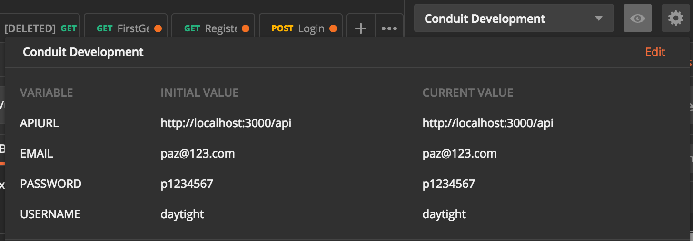

# Tutorial (Part 3)

## Testing Authentication

There are a few bugs in the tutorial I needed to solve. 

We'll be testing the backend with Postman (downloaded in Tutorial Part 1).

To test our authentication endpoints, we need that can make requests to our API. This could be a built-out Front end 
application running in our browser, but for now we are inspecting the request **payload/parameters and responses**, via 
*Postman*

Two things are needed: 

- The pre-made [Conduit collection](https://raw.githubusercontent.com/gothinkster/realworld/master/api/Conduit.postman_collection.json) provided.
Add this link into the Postman window: *Import > Import from Link*

- Create an "Environment" as shown in the figure below (I named it Conduit Environment):

Exercise: Make sure all CRUD requests in the `Auth` folder work. These include:

- 3 POST requests
- 1 GET request
- 1 PUT request 
 
In addition I built a GET AllUsers request to track what was in my database that should be deleted during development. In `users.js`: 

    router.get('/db', function(req, res){
      User.find(function(err, users){
        if (err) return console.error(err);
        return res.json({users: users})
      })
    });

## Creating Profiles for Users

To solve user security issues, we'll need to create a method on the `User` model that will output a version of the user's 
information that is appropriate for their **public profile**. Per our API spec for profiles, the data we should be 
sending back should look like this:

    {
      "profile": {
        "username": "jake",
        "bio": "I work at statefarm",
        "image": "https://static.productionready.io/images/smiley-cyrus.jpg",
        "following": false
      }
    }
    
We can return the user's username, bio, and image from the User model for their public profile. Since we haven't created 
the functionality that allows users to follow each other (yet), we'll just hard code the following attribute to false.

In `models/User.js`, create a method that returns public profile data:

    UserSchema.methods.toProfileJSONFor = function(){
      return {
        username: this.username,
        bio: this.bio,
        image: this.image || 'https://static.productionready.io/images/smiley-cyrus.jpg',
        following:  false  // we'll implement following functionality in a few chapters :)
      };
    };

If you're viewing the profile of another user and they don't have an image set, then we want to show a default image 
instead of showing nothing. In this case, the default image we've made is a smiley face called "Smiley Cyrus", shown 
only when `this.image === null` (falsy).

### Creating the profile endpoint

Now that we have a method to retrieve a user's public profile let's create the publicly accessible endpoint that will 
return this data to our frontend.

The first thing we'll need to do is create a router that will be responsible for all profile related routes. 
For now, we'll only create the route responsible for GETting a user's profile, but in later chapters, we'll also create 
routes for following and unfollowing profiles.

In `routes/api/profiles.js` create a router for profiles:

    var router = require('express').Router();
    var mongoose = require('mongoose');
    var User = mongoose.model('User');
    var auth = require('../auth');
    
    module.exports = router;

Excellent! The next thing we need to do is register our new profiles router with the API router. We want all routes to 
be prefixed with `/profiles` (per the API spec), so we need to specify `/profiles` when we register our profiles router.

Register the profiles router with the API router (`routes/api/index.js`):

    router.use('/', require('./users'));
    +router.use('/profiles', require('./profiles'));
    
With our profiles router now integrated with the API router, we can now build out the endpoint for getting a user's 
profile. Before we can get the route to work though, we'll need to create a router URL parameter middleware for finding 
the user whose username is specified in the URL.

Prepopulate `req.profile` with the user's data when the `:username` parameter is contained within a route. 
In `routes/api/profiles.js`:

    router.param('username', function(req, res, next, username){
      User.findOne({username: username}).then(function(user){
        if (!user) { return res.sendStatus(404); }
    
        req.profile = user;
    
        return next();
      }).catch(next);
    });
    
Finally, we'll define the `GET` route for `profiles/:username` that will return the profile data that was prepopulated by 
the parameter middleware we just created.

Create an endpoint to fetch a user's profile by their username (endpoint in `routes/api/profiles.js`):

    router.get('/:username', auth.optional, function(req, res, next){
        return res.json({profile: req.profile.toProfileJSONFor()});
    });

And the endpoint should now work!

However, if you think ahead to the functionality we'll need to build later (specifically following/unfollowing), this 
route will need to tell the `toProfileJSONFor` method who the currently logged in user is to determine whether or not 
following should be `true` or `false`.

Update `models/User.js` to accept a user object parameter:

    - UserSchema.methods.toProfileJSONFor = function(){
    + UserSchema.methods.toProfileJSONFor = function(user){   

Back in our router, we'll need to look up the current user by ID from the JWT payload and pass along the user object to 
`profile.toProfileJSONFor` if it exists. Otherwise, we'll just pass along `false` to indicate there isn't a currently 
logged in user.

Update the `GET` route to pass along the relevant data into `profile.toProfileJSONFor`'s user parameter (in `profiles.js`):

    router.get('/:username', auth.optional, function(req, res, next){
      if(req.payload){
        User.findById(req.payload.id).then(function(user){
          if(!user){ return res.json({profile: req.profile.toProfileJSONFor(false)}); }
    
          return res.json({profile: req.profile.toProfileJSONFor(user)});
        });
      } else {
        return res.json({profile: req.profile.toProfileJSONFor(false)});
      }
    });
    
Done! You can sleep soundly tonight knowing that we won't have to significantly refactor this code when we implement 
following functionality :) Had we not fixed that up it could've caused us a huge headache down the road, which is why 
it's always a good idea to step back and think about the big picture from time to time while building out your APIs.

